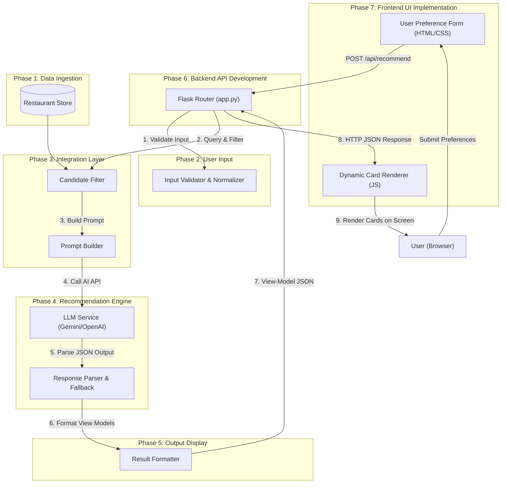
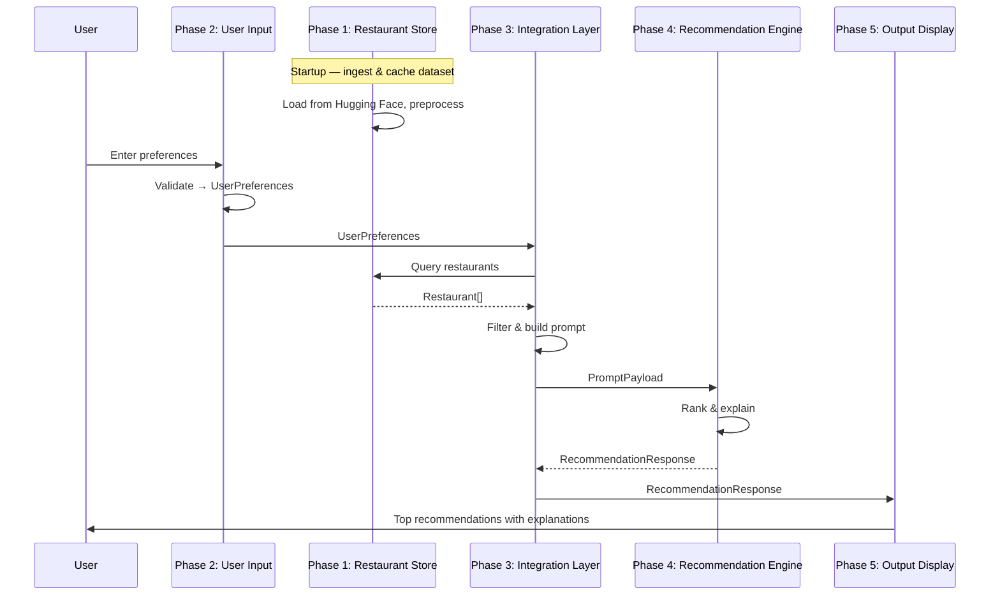
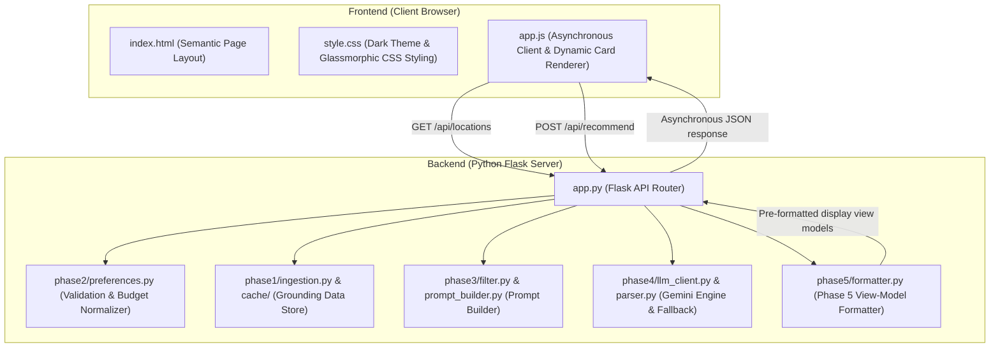
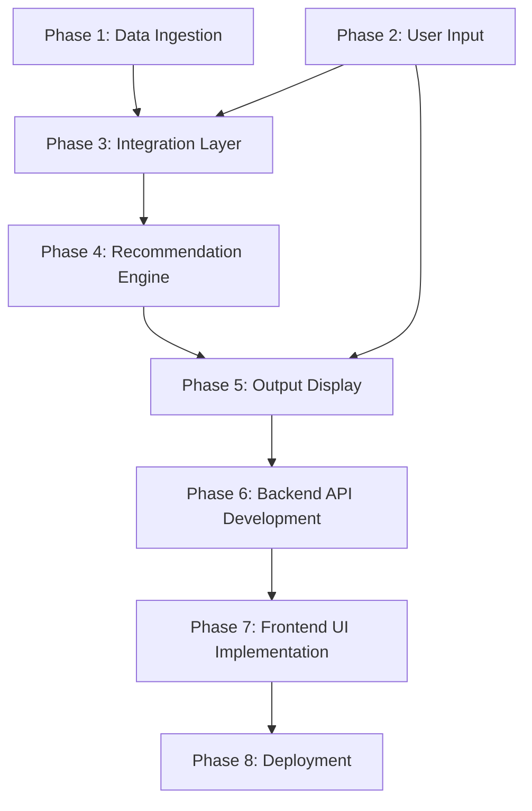

# Phase-Wise Architecture: AI-Powered Restaurant Recommendation System

This document describes the system architecture aligned with the workflow defined in [problemstatement.md](./problemstatement.md). Each phase maps to a distinct layer with clear inputs, outputs, and responsibilities.

---

## High-Level View



**Design principle:** Structured data handles filtering and grounding; the LLM handles ranking, reasoning, and natural-language explanations. The UI never talks to the LLM directly — all requests flow through the integration layer.

---

## Phase Overview

| Phase | Name | Primary Goal | Key Output |
|-------|------|--------------|------------|
| 1 | Data Ingestion | Load and normalize restaurant data | Queryable restaurant records |
| 2 | User Input | Capture and validate preferences | `UserPreferences` object |
| 3 | Integration Layer | Filter candidates and build LLM context | Filtered list + prompt payload |
| 4 | Recommendation Engine | Rank and explain matches | Ranked recommendations with rationale |
| 5 | Output Display | Present results to the user | Rendered recommendation cards |
| 6 | Backend API Development | Expose API endpoints and orchestrate pipeline | JSON REST endpoints |
| 7 | Frontend UI Implementation | Build interactive interface for user recommendations | Rendered responsive UI |
| 8 | Deployment | Host application in production using free cloud tiers | Running production app with secret keys |

---

## Phase 1: Data Ingestion

### Purpose

Transform the raw Zomato dataset from Hugging Face into clean, structured records the rest of the system can filter and pass to the LLM.

### Components

| Component | Responsibility |
|-----------|----------------|
| **Dataset Loader** | Fetch data from [ManikaSaini/zomato-restaurant-recommendation](https://huggingface.co/datasets/ManikaSaini/zomato-restaurant-recommendation) via `datasets` or equivalent |
| **Preprocessor** | Normalize location names, parse cost ranges, coerce ratings to numeric, handle missing values |
| **Schema Mapper** | Map raw columns to a consistent internal model |
| **Restaurant Store** | In-memory list, local JSON/Parquet cache, or lightweight DB for fast filtering |

### Internal Data Model

```text
Restaurant {
  id: string
  name: string
  location: string          // city or area
  cuisines: string[]        // e.g. ["Italian", "Continental"]
  cost_for_two: number      // normalized INR estimate
  budget_tier: enum         // low | medium | high (derived)
  rating: float             // e.g. 4.2
  votes: int                // optional, for tie-breaking
  attributes: string[]      // e.g. ["family-friendly", "delivery"]
}
```

### Inputs & Outputs

- **Input:** Raw Hugging Face dataset rows
- **Output:** Validated `Restaurant[]` collection ready for filtering

### Phase Deliverables

- One-time or on-startup ingestion script
- Normalized dataset cached locally to avoid repeated downloads
- Basic data quality checks (non-empty name, valid rating range)

---

## Phase 2: User Input

### Purpose

Collect user preferences through a simple interface and convert them into a typed, validated structure.

### Components

| Component | Responsibility |
|-----------|----------------|
| **Preference Form** | Web form, CLI prompts, or API request body for user input |
| **Input Validator** | Enforce required fields, valid locations, rating bounds, allowed budget tiers |
| **Preference Normalizer** | Map free-text (e.g. "cheap") to structured values (e.g. `budget: low`) |

### Internal Data Model

```text
UserPreferences {
  location: string            // required
  budget: enum               // low | medium | high
  cuisine: string            // optional filter
  min_rating: float          // optional, default 0
  additional_context: string // free-text: "family-friendly, quick service"
}
```

### Inputs & Outputs

- **Input:** Raw user entries from UI or API
- **Output:** Validated `UserPreferences` object (or validation errors)

### Phase Deliverables

- Input schema with defaults and error messages
- Support for optional fields without blocking the flow
- Clear mapping between form labels and internal fields

---

## Phase 3: Integration Layer

### Purpose

Bridge structured data and the LLM. Filter restaurants to a manageable candidate set, then assemble a prompt the model can reason over.

### Components

| Component | Responsibility |
|-----------|----------------|
| **Candidate Filter** | Apply hard filters: location, cuisine, min rating, budget tier |
| **Candidate Limiter** | Cap results (e.g. top 15–20 by rating) to stay within token limits |
| **Prompt Builder** | Serialize user preferences + candidate restaurants into a structured prompt |
| **Prompt Template** | Defines system instructions, output format (JSON), and ranking criteria |

### Filtering Logic (Structured)

```text
candidates = restaurants
  .filter(location matches user.location)
  .filter(cuisine includes user.cuisine, if provided)
  .filter(rating >= user.min_rating)
  .filter(budget_tier matches user.budget)
  .sort(by rating desc, votes desc)
  .take(N)
```

### Prompt Structure

```text
System:  You are a restaurant recommendation assistant...
User:    Preferences: { location, budget, cuisine, min_rating, context }
         Candidates:  [ { name, cuisine, rating, cost, attributes }, ... ]
         Task:        Rank top 5, explain each pick, optional summary
Output:  Structured JSON (rank, name, explanation, ...)
```

### Inputs & Outputs

- **Input:** `Restaurant[]` from Phase 1, `UserPreferences` from Phase 2
- **Output:** `PromptPayload` (prompt string + metadata: candidate IDs, filter stats)

### Phase Deliverables

- Deterministic filter module (testable without LLM)
- Versioned prompt template
- Fallback when zero candidates match (suggest relaxing filters)

---

## Phase 4: Recommendation Engine

### Purpose

Use the LLM to rank filtered candidates and generate human-like explanations grounded in real restaurant data.

### Components

| Component | Responsibility |
|-----------|----------------|
| **LLM Client** | Call OpenAI, Anthropic, Gemini, or local model via API |
| **Request Handler** | Send prompt, manage temperature, max tokens, retries |
| **Response Parser** | Parse JSON/markdown output into typed recommendation objects |
| **Fallback Ranker** | If LLM fails, return top-N by rating with template explanations |

### Internal Data Model

```text
Recommendation {
  rank: int
  restaurant_id: string
  name: string
  cuisine: string
  rating: float
  estimated_cost: string
  explanation: string       // LLM-generated
}

RecommendationResponse {
  recommendations: Recommendation[]
  summary: string           // optional trade-off summary
}
```

### LLM Responsibilities vs. Structured Layer

| Task | Handled By |
|------|------------|
| Hard filtering (location, budget, rating) | Phase 3 — Integration Layer |
| Semantic ranking (context like "family-friendly") | Phase 4 — LLM |
| Natural-language explanations | Phase 4 — LLM |
| Grounding in real restaurant names/data | Phase 3 provides candidates; LLM must not invent restaurants |

### Inputs & Outputs

- **Input:** `PromptPayload` from Phase 3
- **Output:** `RecommendationResponse`

### Phase Deliverables

- LLM integration with configurable model and API key
- Structured output parsing with validation
- Graceful degradation when the API is unavailable

---

## Phase 5: Output Display

### Purpose

Present ranked recommendations in a clear, scannable format so users can quickly compare and choose.

### Components

| Component | Responsibility |
|-----------|----------------|
| **Result Formatter** | Map `RecommendationResponse` to view models |
| **Recommendation Card** | UI component per restaurant: name, cuisine, rating, cost, explanation |
| **Summary Block** | Optional LLM summary of trade-offs across picks |
| **Empty / Error States** | No matches, LLM error, invalid input messaging |

### Display Fields (per recommendation)

| Field | Source |
|-------|--------|
| Restaurant name | Structured data |
| Cuisine | Structured data |
| Rating | Structured data |
| Estimated cost | Structured data |
| AI explanation | LLM output |

### Inputs & Outputs

- **Input:** `RecommendationResponse` from Phase 4
- **Output:** Rendered UI (web page, CLI table, or API JSON response)

### Phase Deliverables

- Consistent card layout for each recommendation
- Loading state while LLM processes
- Re-submit flow to try new preferences

---

## End-to-End Data Flow



---

## Phase 6: Backend API Development

### Purpose

Expose REST API endpoints to serve locations and handle recommendations asynchronously, orchestrating Phases 1 to 5.

### Components

| Component | Responsibility |
|-----------|----------------|
| **API Router** | Flask application defining HTTP endpoints (`/`, `/api/locations`, `/api/recommend`) |
| **Pipeline Orchestrator** | Coordinates preferences validation, candidate filtering, LLM ranking, and display formatting |
| **Config Loader** | Securely loads environment configurations (e.g. `GEMINI_API_KEY`, `LLM_PROVIDER`) |
| **Error Handlers** | Traps validation errors, configuration exceptions, and LLM API failures, returning clean JSON |

### Communication Protocols & Data Contracts

#### 1. Locations Discovery Endpoint (`GET /api/locations`)
* **Request**: No parameters.
* **Response (200 OK)**:
  ```json
  [
    "Banashankari",
    "Bannerghatta Road",
    "Bellandur",
    "Btm"
  ]
  ```

#### 2. AI Recommendations Request Endpoint (`POST /api/recommend`)
* **Request Content-Type**: `application/json`
* **Request Payload**:
  ```json
  {
    "location": "Bellandur",
    "budget": "2000",
    "min_rating": 4.0,
    "additional_context": "outdoor seating, family friendly"
  }
  ```
* **Success Response (200 OK)**:
  ```json
  {
    "recommendations": [
      {
        "rank": 1,
        "restaurant_id": "rest_da71f4678122",
        "name": "Byg Brewski Brewing Company",
        "location": "Bellandur",
        "area": "Sarjapur Road",
        "cuisines": ["Continental", "North Indian", "Italian"],
        "rating": 4.9,
        "rating_text": "4.9 ★",
        "rating_class": "rating-high",
        "cost_text": "₹1600 for two",
        "explanation": "...",
        "attributes": ["microbrewery", "outdoor seating"]
      }
    ],
    "summary": "These recommendations prioritize high-rated restaurants...",
    "fallback": false
  }
  ```
* **Validation / Over-Constrained Error Response (400 Bad Request)**:
  ```json
  {
    "error": "No restaurants matched your filters in this neighborhood.",
    "suggestions": [
      "Remove or change the cuisine filter.",
      "Lower your minimum rating filter (try 4.5 or below)."
    ]
  }
  ```

### Inputs & Outputs

- **Input:** HTTP GET/POST requests from the client frontend
- **Output:** JSON response payloads matching communication protocols

### Phase Deliverables

- Running Flask web server with error handling and logging
- Endpoints fully tested via verification script `tests/verify_api.py`

---

## Phase 7: Frontend UI Implementation

### Purpose

Build a responsive, interactive client interface that captures user preferences and dynamically renders the recommendation results.

### Components

| Component | Responsibility |
|-----------|----------------|
| **Semantic Page Layout** | HTML structure (`index.html`) defining preference form input fields, labels, submit button, loading spinner, and result area |
| **Glassmorphic Stylesheet** | Vanilla CSS styling (`style.css`) providing modern typography, layout grids, visual card components, transitions, and dark mode aesthetics |
| **Async JS Client** | JavaScript (`app.js`) handling submission events, Fetch requests, showing/hiding spinner, and dynamically rendering cards using backend payload values |

### UI Design Architecture


### Inputs & Outputs

- **Input:** User input entries in the preference form
- **Output:** Rendered HTML view models consisting of dynamic recommendation cards and search suggestions

### Phase Deliverables

- Decoupled static frontend files (`index.html`, `style.css`, `app.js`) in `templates/` and `static/`
- Custom CSS visual styling featuring glassmorphism, responsive grid, dynamic transitions, and modern cards
- Error states, loading spinner transitions, and user resubmission flows

---

## Phase 8: Deployment (Streamlit)

### Purpose

Package and deploy the Zomato AI landing page as a Streamlit web application using free-tier cloud platforms.

### Components

| Component | Responsibility |
|-----------|----------------|
| **Streamlit Web App (`streamlit_app.py`)** | A single-page python script implementing the premium Zomato AI layout (search bar, inputs, recommendations grid) and consuming backend pipeline modules directly. |
| **Secrets Manager** | Safely supply variables like `GEMINI_API_KEY` using Streamlit Cloud's secrets configuration (`st.secrets`) or Hugging Face Space secrets. |
| **Streamlit Community Cloud** | Free hosting platform connected to GitHub for automatic builds and deployments. |
| **Hugging Face Spaces (Streamlit SDK)** | Alternative free hosting space natively running the Streamlit app container. |

### Inputs & Outputs

- **Input:** GitHub code repository + Cloud Secrets (`GEMINI_API_KEY`)
- **Output:** Active web app URL serving the Zomato AI landing page interface

### Phase Deliverables

- `streamlit` dependency added to `requirements.txt`
- `streamlit_app.py` created in project root folder containing UI layouts and backend pipeline triggers
- Active production deployment link (e.g. `*.streamlit.app` or Hugging Face Spaces URL)

---

## Suggested Module Layout

```text
project/
├── phase1/
│   ├── ingestion.py          # Phase 1: load & preprocess
│   ├── models.py             # Restaurant, UserPreferences schemas
│   └── cache/                # Local dataset cache
├── phase2/
│   └── preferences.py        # Phase 2: validation & normalization
├── phase3/
│   ├── filter.py             # Phase 3: candidate filtering
│   └── prompt_builder.py     # Phase 3: prompt assembly
├── phase4/
│   ├── llm_client.py         # Phase 4: API calls
│   └── parser.py             # Phase 4: response parsing
├── phase5/
│   └── formatter.py          # Phase 5: view models
├── templates/
│   └── index.html            # Web UI main document
├── static/
│   ├── css/
│   │   └── style.css         # UI Styling stylesheets
│   └── js/
│       └── app.js            # UI Client state and request handler
└── app.py                    # Orchestrates all phases
```


---

## Phase Dependencies & Build Order



| Build Order | Phase | Rationale |
|-------------|-------|-----------|
| 1 | Data Ingestion | Foundation — nothing else works without clean data |
| 2 | User Input | Can be built in parallel with Phase 1 |
| 3 | Integration Layer | Requires both data store and preference schema |
| 4 | Recommendation Engine | Requires prompt builder and sample candidates |
| 5 | Output Display | Requires sample LLM output shape to design UI |
| 6 | Backend API Development | Exposes the functionality of Phases 1-5 via HTTP REST API |
| 7 | Frontend UI Implementation | Consumes Phase 6 API endpoints and provides client-side interaction |
| 8 | Deployment | Exposes the fully styled interface to users via production cloud links |

Phases 1 and 2 can be developed in parallel. Phase 3 is the first integration milestone. Phases 4 and 5 can be stubbed early (mock LLM, static cards) and wired to real services later.

---

## Cross-Cutting Concerns

| Concern | Approach |
|---------|----------|
| **Configuration** | API keys, model name, candidate limit, cache path via environment variables |
| **Logging** | Log filter counts, prompt size, LLM latency, and parse failures |
| **Testing** | Unit tests for filter and parser; integration test with mocked LLM |
| **Security** | Never expose API keys in client-side code; validate all user input server-side |

---

## Success Criteria (Architecture-Level)

- [ ] Phase 1 loads the Hugging Face dataset and exposes a filterable restaurant collection
- [ ] Phase 2 accepts all preference types from the problem statement
- [ ] Phase 3 returns a bounded candidate set and a well-formed prompt
- [ ] Phase 4 returns ranked recommendations with explanations, grounded in Phase 3 candidates
- [ ] Phase 5 displays name, cuisine, rating, cost, and AI explanation for each pick
- [ ] Phase 6 exposes HTTP endpoints for locations and recommendations, returning formatted JSON
- [ ] Phase 7 renders recommendation cards, error messages, and loading animations dynamically in the browser
- [ ] Phase 8 deploys the complete service to a public production URL with secure keys
- [ ] Full pipeline runs end-to-end without manual intervention
